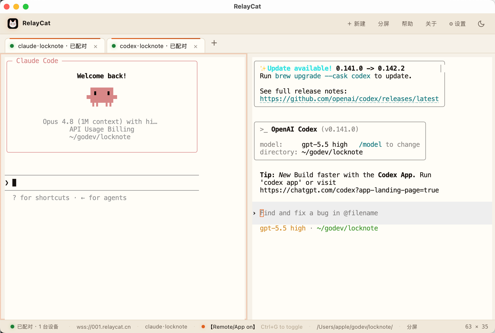
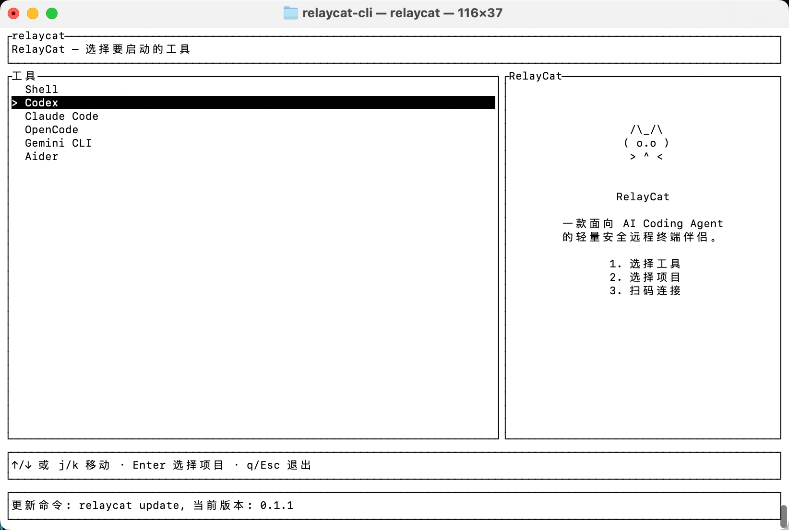
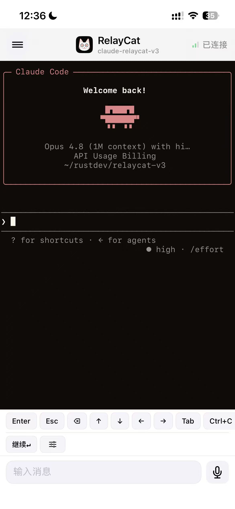
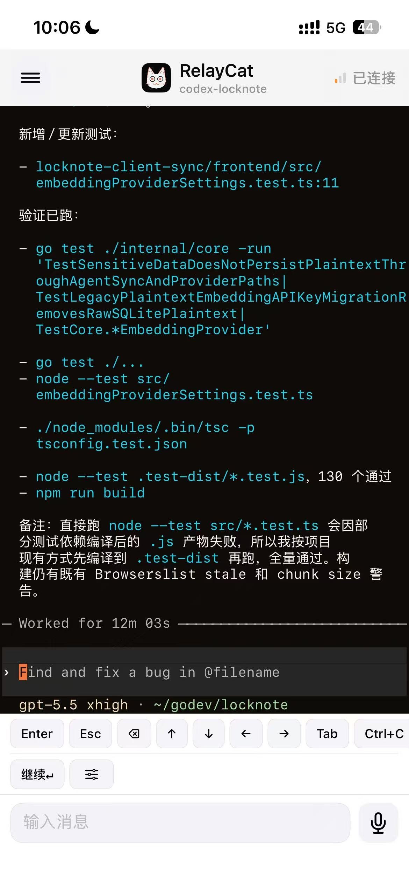
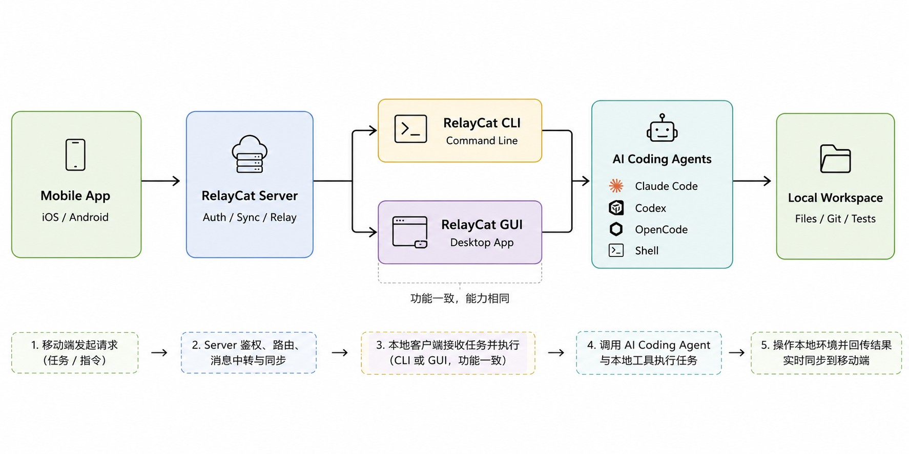

# RelayCat Core

RelayCat Core 是本地 AI Coding Agent 的开源桌面控制层与加密中继层，包含 CLI、桌面 GUI、Relay 服务和共享协议。

它让你在手机上查看和控制电脑里的 Claude Code、Codex、OpenCode、Gemini CLI、Aider 或普通 Shell。代码、终端和 Agent 始终运行在自己的电脑上——**Local execution，Mobile control，End-to-end encryption**。

> RelayCat 不是云 IDE，也不会把项目上传到 Relay 执行。电脑负责真正的任务，手机负责远程交互，Relay 只负责转发加密数据。

## 下载移动端 App

| iOS | Android |
| --- | --- |
| <a href="https://apps.apple.com/cn/app/relaycat%E7%BC%96%E7%A8%8B%E5%8A%A9%E6%89%8B/id6781284514"></a> | <a href="https://cdn.relaycat.cn/download/relaycat-app-0.1.5-android-arm64.apk"></a> |
| [App Store 下载](https://apps.apple.com/cn/app/relaycat%E7%BC%96%E7%A8%8B%E5%8A%A9%E6%89%8B/id6781284514) | [下载 Android 0.1.5 arm64 APK](https://cdn.relaycat.cn/download/relaycat-app-0.1.5-android-arm64.apk) |

桌面端 CLI、GUI 和自建 Relay 安装包可前往 [RelayCat 下载站](https://cdn.relaycat.cn/) 或本仓库的 [GitHub Releases](https://github.com/JackyZhang8/relaycat-core/releases)。

## 产品预览

| RelayCat GUI | RelayCat TUI |
| --- | --- |
|  |  |

| RelayCat App · Claude Code | RelayCat App · Codex |
| --- | --- |
|  |  |

## RelayCat 能做什么？

RelayCat 把已经在本地运行的终端会话安全地延伸到手机上。你可以：

- 在通勤、午饭、排队或离开工位时查看 Agent 的长任务进度。
- 在手机上继续输入提示词、补充上下文或回答 Agent 的问题。
- 发送 Enter、方向键、Ctrl-C 等终端输入，必要时中断失控任务。
- 在 GUI 中管理多个项目和多个独立 PTY 会话。
- 使用官方 Relay 快速连接，或者在自己的服务器和内网中部署 `relaycat-relay`。
- 在断线重连后恢复终端输出，继续跟进本地进程，而不是重新启动任务。

适合以下工作流：

```text
电脑运行 Agent -> RelayCat 建立加密会话 -> 手机扫码配对
       |                                         |
       +------ 项目、凭据和实际执行留在本机 <-----+
```

## 核心特性

- **Local execution**：AI 工具、项目目录、Shell 和 PTY 都在本机运行。
- **手机接管**：扫码后查看终端、输入内容、发送快捷键和中断任务。
- **CLI + GUI 双入口**：终端用户可直接运行 `relaycat`，也可以使用 Tauri 桌面 GUI。
- **E2EE**：桌面端和 App 共同派生会话密钥，Relay 无法解密终端内容。
- **安全配对**：二维码中的 pairing token 用于证明配对资格，不会直接发送给 Relay。
- **断线恢复**：通过序号、快照和 replay 机制恢复短时断线期间的终端变化。
- **自定义工具**：除了内置 Agent，也可以把任意命令作为具名工具会话启动。
- **Self-hosted Relay**：可以将中继部署到自己的服务器、内网或私有网络。

## 三分钟开始使用

### 方式一：使用桌面 GUI

GUI 适合首次使用、同时管理多个项目，或希望通过可视化界面选择工具的用户。

1. 安装并打开 RelayCat GUI。
2. 选择项目目录。
3. 选择 Claude Code、Codex、OpenCode、Gemini CLI、Aider、Shell 或自定义工具。
4. Relay 地址默认可使用官方服务 `wss://001.relaycat.cn`；留空时仅启动本地会话。
5. 启动 Relay 会话后，用手机 App 扫描弹出的二维码。
6. 状态变为“已配对”后，即可在手机和电脑上共同操作该终端。

GUI 提供多标签 PTY、工具检测、项目收藏、二维码展示、连接状态和最近会话入口。它复用 CLI 的会话与加密逻辑，不单独实现另一套协议。

### 方式二：使用 CLI

先确认需要运行的 Agent 已经安装并能在本地终端启动：

```bash
claude --version
codex --version
```

在当前项目中启动远程会话：

```bash
relaycat claude --relay wss://001.relaycat.cn
relaycat codex --relay wss://001.relaycat.cn
```

指定项目目录和自建 Relay：

```bash
relaycat claude \
  --project /path/to/project \
  --relay wss://relay.example.com
```

其他内置工具：

```bash
relaycat opencode --relay wss://001.relaycat.cn
relaycat gemini --relay wss://001.relaycat.cn
relaycat aider --project /path/to/project --relay wss://001.relaycat.cn
relaycat shell --relay wss://001.relaycat.cn
```

启动任意自定义命令：

```bash
relaycat tool my-agent \
  --cmd my-agent \
  --project /path/to/project \
  --relay wss://relay.example.com \
  -- --model flash
```

不带子命令时，`relaycat` 会打开交互式 TUI；不传 `--relay` 时，会话只在本机运行，不生成手机配对二维码。

需要重新显示已有会话的二维码时：

```bash
relaycat qr --project /path/to/project --kind codex
```

### 手机端如何配对

1. 桌面端生成 `relaycat://pair?...` 二维码。
2. 手机 App 扫码，获得 Relay 地址、room、桌面端公钥和一次性配对材料。
3. 桌面端与 App 通过 Relay 交换公开握手信息并验证 pairing proof。
4. 两端独立派生相同的方向密钥，建立 secure session。
5. 后续终端输入和输出都以密文形式经过 Relay。

二维码相当于进入该会话的配对凭证，请像对待临时登录链接一样使用：不要发到公开群聊、工单或截图分享平台。

## 自建 Relay

Relay 只负责 WebSocket 房间、连接管理和密文转发，不需要访问项目目录，也不需要安装 AI 工具。

构建并运行：

```bash
cargo build --release --locked \
  --manifest-path relaycat-server/Cargo.toml

./relaycat-server/target/release/relaycat-relay \
  --listen 127.0.0.1:8787
```

开发或可信内网可以直接使用 `ws://`：

```bash
relaycat codex --relay ws://192.168.1.12:8787
```

公网部署建议：

- 只让 `relaycat-relay` 监听本机或内网地址。
- 使用 Nginx、Caddy 或云负载均衡终止 TLS。
- 正确转发 `/ws` 的 WebSocket Upgrade 请求。
- 对外只暴露 `wss://relay.example.com`。
- 配置连接数、请求频率、日志保留和基础监控。
- 定期更新 CLI、App 和 Relay，避免不同协议版本混用。

E2EE 保护终端 payload，但 TLS 仍然重要：它可以进一步保护 WebSocket 握手、域名访问过程和传输元数据，并降低中间人干扰连接的风险。

## 工作原理



```text
┌──────────────────────────┐
│ Desktop: CLI / GUI       │
│ Project + PTY + AI Agent │
└────────────┬─────────────┘
             │ encrypted WebSocket frames
             ▼
┌──────────────────────────┐
│ relaycat-relay           │
│ room routing only        │
└────────────┬─────────────┘
             │ encrypted WebSocket frames
             ▼
┌──────────────────────────┐
│ RelayCat Mobile App      │
│ terminal view + control  │
└──────────────────────────┘
```

三部分的职责边界非常明确：

| 组件 | 负责什么 | 不负责什么 |
| --- | --- | --- |
| CLI / GUI | 启动本地 PTY、运行 Agent、加解密、生成二维码、同步终端 | 不把项目交给 Relay 执行 |
| Mobile App | 扫码配对、加解密、显示终端、发送输入 | 不直接托管桌面项目和 Agent 进程 |
| Relay | WebSocket 连接、room 匹配、公开握手数据与密文转发 | 不持有会话私钥，不解密终端 payload |

## 加密与安全

RelayCat 当前的安全会话实现使用 protocol v3。设计目标不是“信任 Relay”，而是让 Relay 在完成路由工作的同时无法读取终端明文，也无法在不被检测的情况下修改有效载荷。

### 1. X25519 会话密钥协商

桌面端和 App 各自生成 X25519 密钥对，只交换公钥。双方使用自己的私钥和对方公钥计算共享秘密，私钥不会发送给 Relay。

配对 token 不直接交给 Relay。客户端基于 token、room、角色、设备公钥和 connection salt 生成 HMAC-SHA256 pairing proof，用来证明自己持有正确的配对材料。

### 2. HKDF 派生双向密钥

共享秘密不会被直接当作加密密钥。RelayCat 使用 HKDF-SHA256，并将以下上下文共同绑定到密钥派生过程：

- protocol version；
- room ID；
- CLI 与 App 公钥；
- pairing token hash；
- CLI 与 App 各自生成的 per-connection salt。

最终得到两把独立的 256-bit 方向密钥：

```text
cli_to_app  # 桌面输出 -> 手机
app_to_cli  # 手机输入 -> 桌面
```

不同方向不共用密钥。每次重新连接都会生成新的 connection salt，即使序号从头开始，也会派生出不同的连接密钥，避免 key/nonce reuse。

### 3. ChaCha20-Poly1305 AEAD

终端输入、输出、控制消息和同步消息使用 ChaCha20-Poly1305 加密。AEAD 同时提供：

- **Confidentiality**：Relay 不能读取终端明文；
- **Integrity**：密文或绑定元数据被修改后，接收端解密失败；
- **Authentication**：只有持有正确会话密钥的一端才能生成有效数据帧。

每条消息使用 12 字节 nonce：前 4 字节区分传输方向，后 8 字节来自单调递增的消息序号。

### 4. AAD 与重放防护

以下信息会作为 Additional Authenticated Data 参与认证：

```text
protocol version + room ID + direction + sequence + message type
```

这些字段即使不全部加密，也不能在不触发认证失败的情况下被替换。接收端同时校验方向、nonce 和消息序号，用于拒绝篡改帧、错误方向帧和重复序号。

### 5. Relay 能看到什么？

Relay 为了完成网络连接和路由，仍然可能看到：

- 客户端 IP、连接时间、连接持续时间和流量大小；
- room、角色、方向、序号等路由元数据；
- 设备公钥、connection salt、pairing proof 等公开握手数据；
- nonce、密文长度和密文内容。

Relay 正常情况下不能看到：

- 终端输入和输出明文；
- 项目文件内容；
- 桌面端或 App 的私钥；
- pairing token 原文；
- 从共享秘密派生出的方向密钥。

一个恶意或故障 Relay 仍然可以丢包、延迟、断开连接、观察流量模式或拒绝服务。E2EE 解决的是内容机密性和完整性，不等同于隐藏所有元数据，也不能保证 Relay 永远在线。

### 6. 第三方工具与用户责任

RelayCat 保护的是桌面端和手机端之间的远程终端通道。Claude Code、Codex、OpenCode、Gemini CLI、Aider 或其他工具自身仍可能访问其服务商网络，并遵循各自的账号、模型、日志和隐私政策。

手机远程操作拥有与本地终端相同的实际权限。对以下操作应保持额外谨慎：

- 删除或覆盖文件；
- 修改生产数据库；
- 发布、部署和基础设施变更；
- 处理密钥、证书、钱包或云凭据；
- 执行来源不明的脚本；
- 批量修改尚未提交的代码。

建议在执行高风险命令前回到电脑查看完整上下文，并结合 Git、备份、最小权限和独立测试环境降低风险。

## 仓库结构

```text
relaycat-core/
  relaycat-cli/        # CLI/TUI 桌面桥接，二进制：relaycat
  relaycat-gui/        # Tauri 桌面 GUI，复用 CLI 会话与加密逻辑
  relaycat-server/     # WebSocket Relay，二进制：relaycat-relay
  relaycat-protocol/   # 共享协议类型、帧编码与压缩
  screenshots/         # README 产品截图
```

移动端 App 源码不在本仓库中。本仓库提供开源的 desktop、relay 和 protocol core。

## 从源码构建

### 运行测试

```bash
cargo test --locked --manifest-path relaycat-protocol/Cargo.toml
cargo test --locked --manifest-path relaycat-cli/Cargo.toml
cargo test --locked --manifest-path relaycat-server/Cargo.toml
```

### 构建 CLI

```bash
cargo build --release --locked \
  --manifest-path relaycat-cli/Cargo.toml \
  -p relaycat-cli
```

产物：`relaycat-cli/target/release/relaycat`

### 构建 GUI

GUI 使用 Tauri 2、Vite 和 xterm.js：

```bash
cd relaycat-gui
npm ci
npm run build
npx tauri build
```

Linux 还需要 `libwebkit2gtk-4.1-dev`、`libgtk-3-dev`、`libayatana-appindicator3-dev`、`librsvg2-dev` 和 `patchelf` 等系统依赖。

### 构建 Relay

```bash
cargo build --release --locked \
  --manifest-path relaycat-server/Cargo.toml
```

产物：`relaycat-server/target/release/relaycat-relay`

## 独立发版

CLI、GUI 和 Relay 在同一仓库中维护，但拥有独立版本和 tag：

```text
relaycat-cli-v<version>
relaycat-gui-v<version>
relaycat-relay-v<version>
```

对应 GitHub Actions：

```text
.github/workflows/release-cli.yml
.github/workflows/release-gui.yml
.github/workflows/release-relay.yml
```

三个产品不要求同步升级版本。

## 相关文档

- CLI：[relaycat-cli/README.md](relaycat-cli/README.md)
- GUI：[relaycat-gui/README.md](relaycat-gui/README.md)
- Relay server：[relaycat-server/README.md](relaycat-server/README.md)
- Protocol：[relaycat-protocol/README.md](relaycat-protocol/README.md)
- Protocol frames：[relaycat-protocol/docs/relaycat-v2-protocol.md](relaycat-protocol/docs/relaycat-v2-protocol.md)

## License

各 crate 和组件的许可证以对应 `Cargo.toml`、源码头部及发布包中的许可文件为准。
